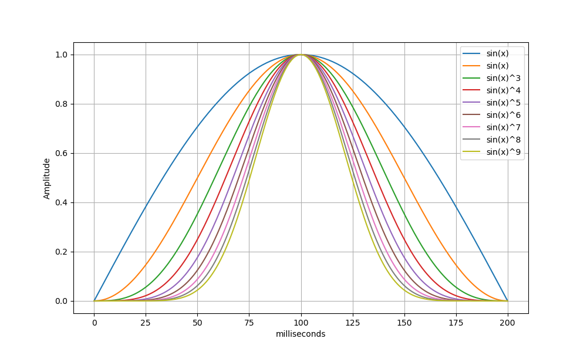

# Sync Tones

Sync tones are short audio signals played in the left track of EyeStims videos to help identify precise timestamps at at which stimuli are displayed in the video track.

Each sync-tone is composed of two sine waves, using standard telephone [DTMF](https://en.wikipedia.org/wiki/DTMF_signaling) frequencies. Two sets of four frequencies can create sixteen different tones.

The amplitude profile of the sync-tones is designed to be easily pinpointed in time, independently of the audio volume at which the tones are played or the sampling rate at which they are recorded. An arbitrary threshold can be used to find the location of each tone. The center of each region above the threshold determines the precise location of each tone.

Tone amplitudes rise and fall according to a positive half-cycle sine wave raised to the fourth power (sin^4 in the figure below). Tones last no more than 200 milliseconds in duration, with peak amplitude centered at the 100 millisecond point.

In addition to being easy to locate within digital recordings, this amplitude profile avoids creating unpleasant distorted noise when played over a speaker, and it is long enough to be reliably identified by DTMF decoding circuits.
